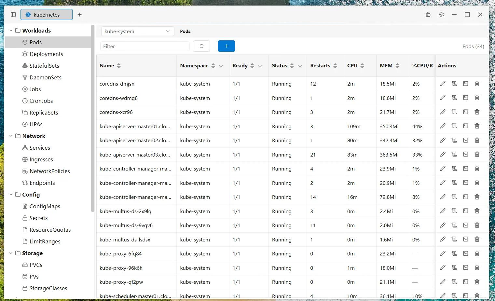
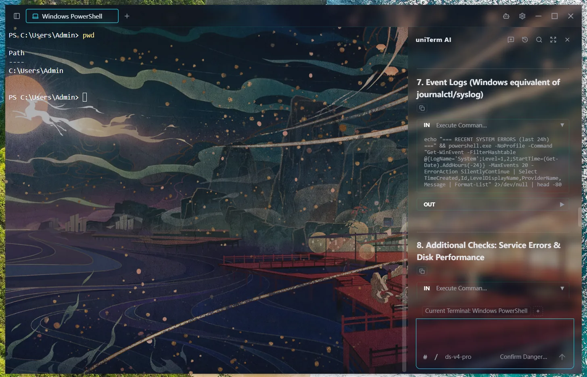

<div align="center">
  
  <h1>uniTerm</h1>
  <p>A lightweight all-in-one terminal with 20+ protocols — SSH, RDP, SFTP, databases, Kubernetes and more<br>With a built-in autonomous AI Agent that plans and runs multi-turn shell commands</p>
  <p><a href="https://uniterm.net">🌐 Homepage</a> &nbsp;|&nbsp; <a href="https://uniterm.net/guide/en/introduction">📖 User Guide</a> &nbsp;|&nbsp; <a href="https://github.com/ys-ll/uniterm">💻 GitHub</a> &nbsp;|&nbsp; <a href="https://gitee.com/ys-l/uniterm">💻 Gitee</a></p>
</div>

<div align="center">

English &nbsp;|&nbsp; <a href="README_zh-CN.md">简体中文</a>

<br>

<a href="https://github.com/ys-ll/uniterm/releases/latest"></a>
<a href="https://github.com/ys-ll/uniterm"></a>
<a href="LICENSE"></a>
<a href="https://github.com/ys-ll/uniterm"></a>
<a href="https://gitee.com/ys-l/uniterm"></a>

</div>


>This repository is forked from the upstream project ys-ll/uniterm.
>I have conducted extensive and aggressive refactoring, experience optimization and underlying modifications to the source code with the assistance of LLM programming tools. All changes are maintained independently within this fork. Any universally applicable bug fixes and feature improvements will be sorted out and submitted to the upstream repository via Pull Requests to contribute back to the original community.
>
>Note that many customized changes in this fork are tailored to personal usage scenarios and may not be suitable for merging into the upstream mainline, so some modifications will remain in this fork permanently.

## Table of Contents

- [Quick Start](#quick-start)
- [Features](#features)
- [Supported Protocols](#supported-protocols)
- [Screenshots](#screenshots)
- [Download](#download)
- [Quick Workflows](#quick-workflows)
- [Tech Stack](#tech-stack)
- [Build from Source](#build-from-source)
- [Project Structure](#project-structure)
- [Roadmap](#roadmap)
- [FAQ](#faq)
- [Star this Project](#star-this-project)
- [Feedback & Contributing](#feedback--contributing)
- [License](#license)

## Quick Start

Already have uniterm installed? Open it once, then connect to your first SSH server:

```bash
# 1. Install (pick your OS)
brew install --cask ys-ll/uniterm/uniterm          # macOS
scoop install uniterm                              # Windows
sudo dpkg -i uniterm-linux-amd64-latest.deb        # Linux (deb)

# 2. Launch
open -a uniterm                                    # macOS
# (double-click the icon on Windows / Linux)

# 3. In the UI: click "+ New Connection" → SSH → fill host/port/auth → Connect
```

Or build from source:

```bash
git clone https://github.com/ys-ll/uniterm.git && cd uniterm
npm --prefix frontend install
go install github.com/wailsapp/wails/v2/cmd/wails@latest
wails build          # binary at build/bin/uniterm
```

## Features

### Full-Featured Terminal

Remote terminal (SSH / Telnet / Mosh), local & serial terminal (PowerShell / CMD / Git Bash / WSL), file transfer, remote desktop, database, containers, and server monitor — covering all remote access needs.

- **Remote Terminal** — SSH / Telnet / Mosh with password or key authentication; includes SSH tunnel port forwarding so any connection can route through an SSH jump host.
- **Local & Serial Terminal** — PowerShell / CMD / Git Bash / WSL plus serial connections with configurable baud rate, data bits, stop bits, parity, and local echo.
- **File Transfer** — SFTP / FTP / FTPS / SMB / WebDAV / S3 / Zmodem with dual-pane browsing and `rz`/`sz` support in SSH terminals.
- **Remote Desktop** — RDP (Windows Remote Desktop), VNC (Linux remote control), SPICE (KVM/QEMU VMs)
- **Database Client** — MySQL / PostgreSQL / Oracle / SQL Server / rqlite / Redis / MongoDB.
- **Containers** — Kubernetes / Docker / Podman / nerdctl
- **Server Monitor** — Real-time CPU, memory, disk, network, processes, ports, and network interfaces.

### AI Assistant

Autonomous AI Agent that independently plans and executes multi-turn shell commands directly in your terminal.

- **Autonomous Multi-Turn Execution** — The AI Agent can plan, execute, observe results, and iterate across multiple rounds of shell commands without manual intervention.
- **LLM Integration** — Sidebar chat with Anthropic/OpenAI-compatible API, supporting Claude, GPT and other compliant models.
- **Flexible Execution Modes** — Bypass, dangerous only, dangerous + write, or confirm all — you control how much oversight the AI Agent needs.
- **Persistent Conversations** — Chat history is saved per session, so conversations survive app restarts.
- **Terminal Integration** — AI commands execute directly in the active terminal tab, with optional pinning to a specific tab or following your active one. Collaborate side-by-side in split panes, each with its own terminal context.
- **Smart Completion** — While typing in SSH terminals, get real-time suggestions from your command history and AI-powered command rewrites.
- **Skills & Commands** — Reusable skill workflows and prompt-template commands, attached with `/` in the AI input; the AI can also save new skills itself.

### Personalization

Connection management, split panes, cloud sync, themes — your terminal, your way.

- **Connection Manager** — Group, quickly search, create, and batch-operate server connections.
- **Split Panes** — Drag terminal tabs into the content area to split freely and combine them into a workspace; drag panel edges to resize and rearrange.
- **Cloud Sync** — Encrypt and auto-sync settings via your own decentralized private repo on GitHub, GitLab, or Gitee — no worry about data loss or leaks, and pick up your work seamlessly across devices.
- **Custom Keybindings** — Freely bind keyboard shortcuts for every action for full keyboard-driven operation, hands never leaving the keyboard.
- **Themes** — 28 terminal themes plus 3 UI themes (Dark / Deep Blue / Light) and a customizable background image.
- **Internationalization** — 9-language UI: Simplified Chinese, Traditional Chinese, English, Japanese, Korean, German, Spanish, French, Russian.

## Supported Protocols

| Category | Protocol | Description |
|----------|----------|-------------|
| Terminal | SSH | Remote server shell management |
| Terminal | Telnet | Remote terminal for legacy devices and embedded systems |
| Terminal | Mosh | Server connections over high-latency or intermittent networks |
| Terminal | Serial | Serial port terminal with configurable baud rate and other parameters |
| Terminal | Local | PowerShell, CMD, Git Bash, and other local shells |
| Terminal | WSL | Open installed WSL distributions via local terminal |
| File Transfer | SFTP | Server file management and transfer |
| File Transfer | FTP / FTPS | Website hosting, NAS file transfer |
| File Transfer | SMB | Windows shared folders, NAS file access |
| File Transfer | WebDAV | WebDAV server file management |
| File Transfer | S3 | Amazon S3 compatible object storage |
| File Transfer | Zmodem | In-terminal file transfer via rz/sz commands |
| Remote Desktop | RDP | Windows server remote desktop management (Windows only) |
| Remote Desktop | VNC | Linux server remote control |
| Remote Desktop | SPICE | KVM/QEMU VM management |
| Database | MySQL | MySQL protocol: MySQL, MariaDB, TiDB, and more |
| Database | PostgreSQL | PostgreSQL protocol: PostgreSQL, CockroachDB, and more |
| Database | Oracle Database | Oracle Database connections through a pure Go driver |
| Database | SQL Server | SQL Server connections through a pure Go driver |
| Database | rqlite | Lightweight distributed DB built on SQLite with Raft consensus |
| Database | Redis | In-memory key-value store with visual key browsing and editing |
| Database | MongoDB | Document database with tree browsing, query editor, and inline editing |
| Containers | Kubernetes | Cluster resource browsing and management, Pod logs and exec, performance metrics |
| Containers | Docker | Container and image management, on the local machine or remote hosts over SSH |
| Containers | Podman | Docker-compatible container engine, on the local machine or remote hosts over SSH |
| Containers | nerdctl | containerd container management with namespace switching |

Oracle Database support is implemented with a pure Go driver. uniTerm does not bundle Oracle Database, Oracle Instant Client, OJDBC, wallet files, or Oracle brand assets; users are responsible for their own Oracle licenses, credentials, and database access.

## Screenshots

<p align="center">
  <picture>
    <source srcset="docs/imgs/start_tab.webp" media="(prefers-color-scheme: dark)" />
    
  </picture>
  <picture>
    <source srcset="docs/imgs/new_connection.webp" media="(prefers-color-scheme: dark)" />
    
  </picture>
</p>
<p align="center">
  <picture>
    <source srcset="docs/imgs/ai_assistant.webp" media="(prefers-color-scheme: dark)" />
    
  </picture>
  <picture>
    <source srcset="docs/imgs/workspace.webp" media="(prefers-color-scheme: dark)" />
    
  </picture>
</p>
<p align="center">
  <picture>
    <source srcset="docs/imgs/sftp.webp" media="(prefers-color-scheme: dark)" />
    
  </picture>
  <picture>
    <source srcset="docs/imgs/database.webp" media="(prefers-color-scheme: dark)" />
    
  </picture>
</p>
<p align="center">
  <picture>
    <source srcset="docs/imgs/kubernetes.webp" media="(prefers-color-scheme: dark)" />
    
  </picture>
  
</p>

## Download

Get the latest pre-built binaries from [GitHub Releases](https://github.com/ys-ll/uniterm/releases) or [Gitee Releases](https://gitee.com/ys-l/uniterm/releases):

- **Windows** (amd64 / arm64): installer `uniterm-windows-*-installer-*.exe`, or portable `uniterm-windows-*-portable-*.zip`
- **macOS** (Intel / Apple Silicon): Download `uniterm-darwin-universal-*.dmg`
- **Linux** (amd64 / arm64): Download `uniterm-linux-*-*.tar.gz`, `.deb`, or `.rpm`

### Package Managers

```bash
# Windows
scoop bucket add uniterm https://github.com/ys-ll/scoop-uniterm && scoop install uniterm

# macOS
brew install --cask ys-ll/uniterm/uniterm

# Linux (deb)
curl -sLo uniterm.deb https://github.com/ys-ll/uniterm/releases/latest/download/uniterm-linux-amd64-*.deb
sudo dpkg -i uniterm.deb

# Linux (rpm)
curl -sLo uniterm.rpm https://github.com/ys-ll/uniterm/releases/latest/download/uniterm-linux-amd64-*.rpm
sudo rpm -i uniterm.rpm
```

### Runtime Dependencies

- **Windows**: WebView2 runtime (included in Windows 10+; older versions need a one-time install)
- **macOS**: No extra dependencies (uses the system WebKit)
- **Linux**: `libgtk-3-0` and `libwebkit2gtk-4.1-0` (preinstalled on most desktop distros)

## Quick Workflows

### SSH Connection

1. Click **New Connection** in the Connection Manager
2. Fill in host, port, and authentication (password or private key)
3. Click **Connect** to open an SSH terminal session

### AI Assistant

1. Go to Settings and configure your **AI provider** (API endpoint, model, and key)
2. Open a terminal tab (SSH or local)
3. Open the AI sidebar chat — type your task, and the AI Agent executes commands directly in your terminal

### SFTP File Transfer

1. In the Connection Manager, **right-click** an SSH connection
2. Select **Connect SFTP**
3. Browse, upload, download, and drag-and-drop files in the dual-pane file manager

## Tech Stack

| Layer | Technology |
|-------|-----------|
| Desktop Framework | Wails v2 |
| Backend | Go |
| Frontend | Vue 3 + Pinia + Element Plus |
| Terminal | xterm.js |
| AI Protocol | Anthropic Messages API / OpenAI Chat Completions API |

## Build from Source

Requires [Go](https://go.dev/dl/) 1.23+, [Node.js](https://nodejs.org/) 20+, and [Wails CLI](https://wails.io/docs/gettingstarted/installation) v2. Additionally, macOS needs Xcode Command Line Tools, and Linux needs `libgtk-3-dev` and `libwebkit2gtk-4.1-dev`.

```bash
git clone https://github.com/ys-ll/uniterm.git
cd uniTerm
cd frontend && npm install && cd ..
wails dev                   # Development
wails build                 # Production build
```

## Project Structure

```
uniTerm/
├── main.go                       # Entry point
├── app.go                        # Wails bindings, LLM API proxy, SFTP API
├── backend/
│   ├── session/                  # SSH/SFTP/database session management
│   ├── database/                 # SQL execution, schema introspection, DSN builders
│   ├── store/                    # Persistent config (connections, AI, settings)
│   └── log/                      # File-based logging
├── frontend/
│   └── src/
│       ├── components/           # Vue components
│       ├── composables/          # Terminal composables
│       ├── stores/               # Pinia stores
│       ├── services/             # AI agent loop, LLM client
│       ├── i18n/                 # Translations
│       └── types/                # TypeScript type definitions
└── wails.json
```

## Roadmap

See [ROADMAP.md](ROADMAP.md) for the current protocol / feature status and what's planned next. For per-release history, see [CHANGELOG.md](CHANGELOG.md).

## FAQ

### SSH public-key authentication

uniterm reads `~/.ssh/id_ed25519`, `~/.ssh/id_rsa`, and `~/.ssh/id_ecdsa` automatically. You can also paste a private key in the connection form's **Authentication → Private Key** field. Passphrases are honored.

### Fonts look wrong / characters render as tofu

The terminal uses [JetBrains Mono](https://github.com/JetBrains/JetBrainsMono) by default. For CJK, the terminal falls back to the platform's best monospace font. If a particular glyph renders as `□`, install a font that covers that range (e.g. `Noto Sans Mono CJK`) and pick it in **Settings → Appearance → Terminal Font**.

### Port forwarding / jump hosts

Open the **Tunnels** panel from the left sidebar, click **+ New Tunnel**, and pick a saved SSH connection as the entry point. uniterm opens a local SOCKS / port-forward on top of the SSH transport; any tool on your machine can then route through it.

### My connection works but the AI Agent can't execute commands

The AI Agent runs commands directly in your active terminal tab. Make sure (1) an SSH or local terminal tab is open and active, (2) **Settings → AI** has a provider + model configured, and (3) your execution mode allows the action — switch from "Confirm all" to "Bypass" or "Confirm dangerous only" if you want fewer interruptions.

### Where are my connections stored?

In the OS application-data directory: `~/Library/Application Support/uniterm` on macOS, `%APPDATA%\uniterm` on Windows, `~/.local/share/uniterm` on Linux. The same folder holds AI settings, skills, and quick commands. To migrate to a new machine, copy that folder or set up **Cloud Sync** in Settings to push it to a private GitHub / GitLab / Gitee repo.

### Linux: `libgtk-3-0` / `libwebkit2gtk-4.1-0` missing

```
sudo apt install libgtk-3-0 libwebkit2gtk-4.1-0   # Debian / Ubuntu
sudo dnf install gtk3 webkit2gtk4.1                # Fedora / RHEL
sudo pacman -S gtk3 webkit2gtk-4.1                 # Arch
```

### How do I report a bug or request a feature?

Open an issue at <https://github.com/ys-ll/uniterm/issues>. For security issues, follow [SECURITY.md](SECURITY.md) — do **not** file a public issue.

## Star this Project

If uniTerm is helpful to you, please consider giving it a ⭐ Star — it's the best encouragement for the project and helps more people discover it.

[](https://github.com/ys-ll/uniterm)
[](https://gitee.com/ys-l/uniterm)

## Feedback &amp; Contributing

Issues, suggestions, and feedback are welcome at [GitHub Issues](https://github.com/ys-ll/uniterm/issues), and contributions via [Pull Request](https://github.com/ys-ll/uniterm/pulls) are always welcome.

Thanks to the following people for contributing code and improvements, and to everyone who reported issues and shared suggestions — you help make uniTerm better ❤️

- [@yuwei5380](https://github.com/yuwei5380)
- [@surenwuyuwuqiu](https://github.com/surenwuyuwuqiu)
- [@wangxufeng](https://github.com/wangxufeng)

## License

Apache 2.0
