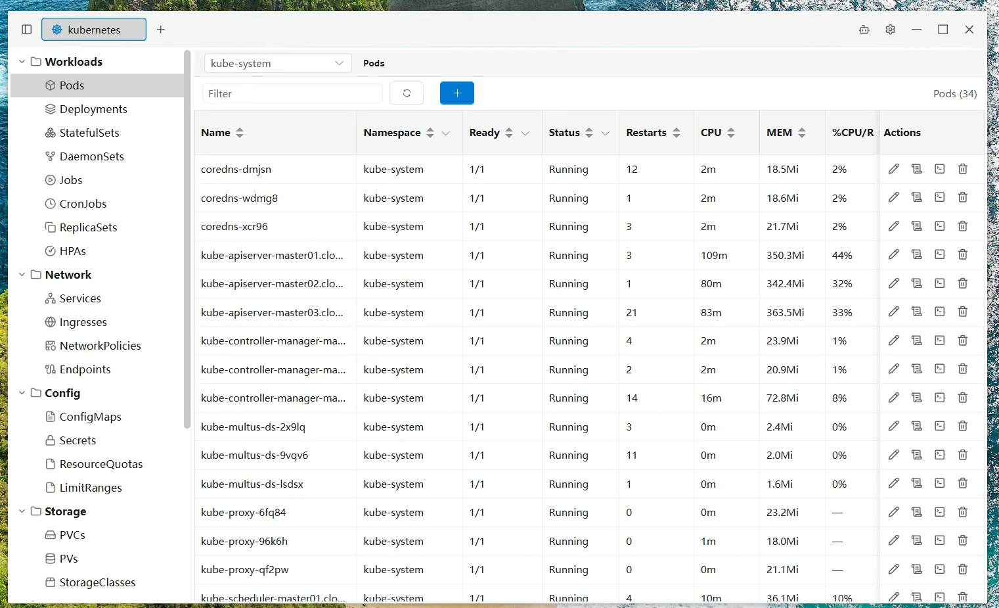
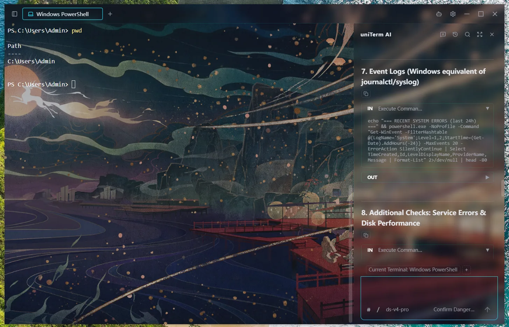

<div align="center">
  
  <h1>uniTerm</h1>
  <p>A lightweight all-in-one terminal with 30+ protocols — SSH, RDP, SFTP, databases, Kubernetes and more<br>With a built-in autonomous AI Agent that plans and runs multi-turn shell commands</p>
  <p><a href="https://uniterm.net">🌐 Homepage</a> &nbsp;|&nbsp; <a href="https://uniterm.net/guide/en/introduction">📖 User Guide</a> &nbsp;|&nbsp; <a href="https://github.com/ys-ll/uniterm">💻 GitHub</a> &nbsp;|&nbsp; <a href="https://gitee.com/ys-l/uniterm">💻 Gitee</a></p>
</div>

<div align="center">

English &nbsp;|&nbsp; <a href="README_zh-CN.md">简体中文</a>

<br>

<a href="https://github.com/ys-ll/uniterm/releases/latest"></a>
<a href="https://github.com/ys-ll/uniterm"></a>
<a href="LICENSE"></a>
<a href="https://github.com/ys-ll/uniterm"></a>
<a href="https://gitee.com/ys-l/uniterm"></a>

</div>

## Table of Contents

- [Features](#features)
- [Supported Protocols](#supported-protocols)
- [Screenshots](#screenshots)
- [Download](#download)
- [Quick Workflows](#quick-workflows)
- [Tech Stack](#tech-stack)
- [Build from Source](#build-from-source)
- [Project Structure](#project-structure)
- [Roadmap](#roadmap)
- [Star this Project](#star-this-project)
- [Feedback & Contributing](#feedback--contributing)
- [License](#license)

## Features

### Full-Featured Terminal

Remote terminal, local & serial terminal, file transfer, remote desktop, database, containers, and server monitor — covering all remote access needs.

- **Remote Terminal** — SSH / Telnet / Mosh / Raw TCP with password or key authentication; includes SSH tunnel port forwarding so any connection can route through an SSH jump host.
- **Local & Serial Terminal** — PowerShell / CMD / Git Bash / WSL plus serial connections with configurable baud rate, data bits, stop bits, parity, and local echo.
- **File Transfer** — SFTP / SCP / FTP / FTPS / SMB / WebDAV / S3 / Zmodem with dual-pane browsing and `rz`/`sz` support in SSH terminals.
- **Remote Desktop** — RDP (Windows Remote Desktop), VNC (Linux remote control), SPICE (KVM/QEMU VMs), X11 (X Window forwarding)
- **Database Client** — MySQL / PostgreSQL / Oracle / SQL Server / rqlite / Redis / MongoDB / Elasticsearch.
- **Containers** — Kubernetes / Docker / Podman / nerdctl (containerd) / WSLC
- **Server Monitor** — Real-time CPU, memory, disk, network, processes, ports, and network interfaces.

### AI Assistant

Autonomous AI Agent that independently plans and executes multi-turn shell commands directly in your terminal.

- **Autonomous Multi-Turn Execution** — The AI Agent can plan, execute, observe results, and iterate across multiple rounds of shell commands without manual intervention.
- **LLM Integration** — Sidebar chat with Anthropic/OpenAI-compatible API, supporting Claude, GPT and other compliant models.
- **Flexible Execution Modes** — Bypass, dangerous only, dangerous + write, or confirm all — you control how much oversight the AI Agent needs.
- **Persistent Conversations** — Chat history is saved per session, so conversations survive app restarts.
- **Terminal Integration** — AI commands execute directly in the active terminal tab, with optional pinning to a specific tab or following your active one. Collaborate side-by-side in split panes, each with its own terminal context.
- **Smart Completion** — While typing in SSH terminals, get real-time suggestions from your command history and AI-powered command rewrites.
- **Skills & Commands** — Reusable skill workflows and prompt-template commands, attached with `/` in the AI input; the AI can also save new skills itself.

### Personalization

Connection management, split panes, cloud sync, themes — your terminal, your way.

- **Connection Manager** — Group, quickly search, create, and batch-operate server connections.
- **Split Panes** — Drag terminal tabs into the content area to split freely and combine them into a workspace; drag panel edges to resize and rearrange.
- **Cloud Sync** — Encrypt and auto-sync settings via your own decentralized private repo on GitHub, GitLab, or Gitee — no worry about data loss or leaks, and pick up your work seamlessly across devices.
- **Custom Keybindings** — Freely bind keyboard shortcuts for every action for full keyboard-driven operation, hands never leaving the keyboard.
- **Themes** — 28 terminal themes plus 3 UI themes (Dark / Deep Blue / Light) and a customizable background image.
- **Internationalization** — 9-language UI: Simplified Chinese, Traditional Chinese, English, Japanese, Korean, German, Spanish, French, Russian.

## Supported Protocols

| Category | Protocol | Description |
|----------|----------|-------------|
| Terminal | SSH | Remote server shell management |
| Terminal | Telnet | Remote terminal for legacy devices and embedded systems |
| Terminal | Mosh | Server connections over high-latency or intermittent networks |
| Terminal | Serial | Serial port terminal with configurable baud rate and other parameters |
| Terminal | Raw TCP | Raw TCP console that opens a plain socket and transceives raw bytes |
| Terminal | Local | PowerShell, CMD, Git Bash, and other local shells |
| Terminal | WSL | Open installed WSL distributions via local terminal (Windows only) |
| File Transfer | SFTP | Server file management and transfer |
| File Transfer | SCP | Fallback protocol for legacy SSH servers that do not support SFTP |
| File Transfer | FTP / FTPS | Website hosting, NAS file transfer |
| File Transfer | SMB | Windows shared folders, NAS file access |
| File Transfer | WebDAV | WebDAV server file management |
| File Transfer | S3 | Amazon S3 compatible object storage |
| File Transfer | Zmodem | In-terminal file transfer via rz/sz commands |
| Remote Desktop | RDP | Windows server remote desktop management (Windows only) |
| Remote Desktop | VNC | Linux server remote control |
| Remote Desktop | SPICE | KVM/QEMU VM management |
| Remote Desktop | X11 | X Window forwarding |
| Database | MySQL | MySQL protocol: MySQL, MariaDB, TiDB, and more |
| Database | PostgreSQL | PostgreSQL protocol: PostgreSQL, CockroachDB, and more |
| Database | Oracle Database | Oracle Database connections through a pure Go driver |
| Database | SQL Server | SQL Server connections through a pure Go driver |
| Database | rqlite | Lightweight distributed DB built on SQLite with Raft consensus |
| Database | Redis | In-memory key-value store with visual key browsing and editing |
| Database | MongoDB | Document database with tree browsing, query editor, and inline editing |
| Database | Elasticsearch | Distributed search and analytics engine with index and document management |
| Containers | Kubernetes | Cluster resource browsing and management, Pod logs and exec, performance metrics |
| Containers | Docker | Container and image management, on the local machine or remote hosts over SSH |
| Containers | Podman | Docker-compatible container engine, on the local machine or remote hosts over SSH |
| Containers | nerdctl (containerd) | containerd container management with namespace switching |
| Containers | WSLC | Windows WSL2 Container runtime (Windows only) |

Oracle Database support is implemented with a pure Go driver. uniTerm does not bundle Oracle Database, Oracle Instant Client, OJDBC, wallet files, or Oracle brand assets; users are responsible for their own Oracle licenses, credentials, and database access.

## Screenshots

<p align="center">
  <picture>
    <source srcset="docs/imgs/start_tab.webp" media="(prefers-color-scheme: dark)" />
    
  </picture>
  <picture>
    <source srcset="docs/imgs/new_connection.webp" media="(prefers-color-scheme: dark)" />
    
  </picture>
</p>
<p align="center">
  <picture>
    <source srcset="docs/imgs/ai_assistant.webp" media="(prefers-color-scheme: dark)" />
    
  </picture>
  <picture>
    <source srcset="docs/imgs/workspace.webp" media="(prefers-color-scheme: dark)" />
    
  </picture>
</p>
<p align="center">
  <picture>
    <source srcset="docs/imgs/sftp.webp" media="(prefers-color-scheme: dark)" />
    
  </picture>
  <picture>
    <source srcset="docs/imgs/database.webp" media="(prefers-color-scheme: dark)" />
    
  </picture>
</p>
<p align="center">
  <picture>
    <source srcset="docs/imgs/kubernetes.webp" media="(prefers-color-scheme: dark)" />
    
  </picture>
  
</p>

## Download

Get the latest pre-built binaries from [GitHub Releases](https://github.com/ys-ll/uniterm/releases) or [Gitee Releases](https://gitee.com/ys-l/uniterm/releases):

- **Windows** (amd64 / arm64): installer `uniterm-windows-*-installer-*.exe`, or portable `uniterm-windows-*-portable-*.zip`
- **macOS** (Apple Silicon arm64 / Intel amd64): Download `uniterm-darwin-*-*.dmg`
- **Linux** (amd64 / arm64): Download `uniterm-linux-*-*.tar.gz`, `.deb`, or `.rpm`
- **Linux legacy** (amd64 / arm64): For enterprise distros with older system libraries — Kylin V10/V11, UOS / deepin, RHEL 8, openEuler. Download `uniterm-linux-legacy-*-*.tar.gz`, `.deb`, or `.rpm`. Use this if the standard package fails with `undefined symbol: webkit_web_view_evaluate_javascript` (WebKit older than 2.40)
- **Android** (arm64, prerelease): Download `uniterm-android-arm64-*.apk` (debug-signed; you will need to allow "install unknown apps" to install it)

> **About Windows antivirus false positives**: As this open-source software has not purchased a code-signing certificate, the unsigned executable may trigger false positives in some antivirus engines (e.g. Windows Defender). This is a known issue with Go/Wails applications (see [wailsapp/wails#3308](https://github.com/wailsapp/wails/issues/3308)). You can add an exclusion rule in your antivirus to allow it. Please download only from the official open-source channels — GitHub and Gitee. If you are still concerned about malware, you can download the source code and build and run it locally yourself.

### Package Managers

```bash
# Windows
scoop bucket add uniterm https://github.com/ys-ll/scoop-uniterm && scoop install uniterm

# macOS
brew install --cask ys-ll/uniterm/uniterm

# Linux (deb)
curl -sLo uniterm.deb https://github.com/ys-ll/uniterm/releases/latest/download/uniterm-linux-amd64-*.deb
sudo dpkg -i uniterm.deb

# Linux (rpm)
curl -sLo uniterm.rpm https://github.com/ys-ll/uniterm/releases/latest/download/uniterm-linux-amd64-*.rpm
sudo rpm -i uniterm.rpm
```

### Runtime Dependencies

- **Windows**: WebView2 runtime (included in Windows 10+; older versions need a one-time install)
- **macOS**: No extra dependencies (uses the system WebKit)
- **Linux**: `libgtk-3-0` and `libwebkit2gtk-4.1-0` (preinstalled on most desktop distros)
- **Linux legacy**: `gtk3` and `webkit2gtk3` (WebKit2GTK 4.0 ABI; WebKit 2.38 is sufficient — no 2.40+ required)
- **Android**: Android 5.0+ (uses the system WebView, no extra dependencies)

## Quick Workflows

### SSH Connection

1. Click **New Connection** in the Connection Manager
2. Fill in host, port, and authentication (password or private key)
3. Click **Connect** to open an SSH terminal session

### AI Assistant

1. Go to Settings and configure your **AI provider** (API endpoint, model, and key)
2. Open a terminal tab (SSH or local)
3. Open the AI sidebar chat — type your task, and the AI Agent executes commands directly in your terminal

### SFTP File Transfer

1. In the Connection Manager, **right-click** an SSH connection
2. Select **Connect SFTP**
3. Browse, upload, download, and drag-and-drop files in the dual-pane file manager

## Tech Stack

| Layer | Technology |
|-------|-----------|
| Desktop Framework | Wails v3 |
| Backend | Go |
| Frontend | Vue 3 + Pinia + Element Plus |
| Terminal | xterm.js |
| AI Protocol | Anthropic Messages API / OpenAI Chat Completions API |

## Build from Source

- [Go](https://go.dev/dl/) 1.26+
- [Node.js](https://nodejs.org/) 20+
- [wails3 CLI](https://wails.io/docs/) v3.0.0-beta.27 (install with `go install github.com/wailsapp/wails/v3/cmd/wails3@v3.0.0-beta.27`)
- macOS needs Xcode Command Line Tools
- Linux needs `libgtk-3-dev` and `libwebkit2gtk-4.1-dev`
- Android builds additionally need JDK 21 and the Android SDK/NDK (`sdkmanager "platform-tools" "platforms;android-35" "build-tools;35.0.0" "ndk;26.3.11579264"`)

```bash
git clone https://github.com/ys-ll/uniterm.git
cd uniTerm
cd frontend && npm install && cd ..
wails3 dev                  # Development
wails3 build                # Production build
```

## Project Structure

```
uniTerm/
├── main.go                       # Entry point
├── app.go                        # Wails bindings, LLM API proxy, SFTP API
├── app_*.go                      # Platform-specific implementations
├── backend/
│   ├── session/                  # SSH/Telnet/Serial/SFTP/database session management
│   ├── database/                 # SQL execution, schema introspection, DSN builders
│   ├── container/                # Docker/Podman/nerdctl container management
│   ├── k8s/                      # Kubernetes cluster management
│   ├── store/                    # Persistent config (connections, AI, settings)
│   ├── sync/                     # Cloud sync (GitHub/GitLab/Gitee)
│   ├── update/                   # Auto-update
│   ├── platform/                 # Platform abstraction layer
│   └── log/                      # File-based logging
├── frontend/
│   └── src/
│       ├── components/           # Vue components
│       ├── composables/          # Terminal composables
│       ├── stores/               # Pinia stores
│       ├── services/             # AI agent loop, LLM client
│       ├── i18n/                 # Translations
│       ├── types/                # TypeScript type definitions
│       ├── utils/                # Utility functions
│       └── vendor/               # Third-party libraries
├── plugins/                      # Plugin directory
├── docs/                         # Documentation
├── Taskfile.yml                  # wails3 build tasks
└── build/
    └── config.yml                # build config (app info, dev mode)
```

## Roadmap

See [ROADMAP.md](ROADMAP.md) for the current protocol / feature status and what's planned next. For per-release history, see [CHANGELOG.md](CHANGELOG.md).

## Star this Project

If uniTerm is helpful to you, please consider giving it a ⭐ Star — it's the best encouragement for the project and helps more people discover it.

[](https://github.com/ys-ll/uniterm)
[](https://gitee.com/ys-l/uniterm)

## Feedback &amp; Contributing

This is a personal hobby project maintained in the author's spare time, with no commercialization or sponsorship plans — anyone who shares the same interest is warmly welcome to join, discuss, and build together.

Issues, suggestions, and feedback are welcome at [GitHub Issues](https://github.com/ys-ll/uniterm/issues), and code contributions via [Pull Request](https://github.com/ys-ll/uniterm/pulls) are always welcome. Due to the wide variety of terminal environments and usage scenarios, the author cannot cover every possible case in testing — if you run into any issues, feel free to fork the project and contribute directly. This project welcomes vibe coding.

Thanks to the following people for contributing code and improvements, and to everyone who reported issues and shared suggestions — you help make uniTerm better ❤️

- [@yuwei5380](https://github.com/yuwei5380)
- [@surenwuyuwuqiu](https://github.com/surenwuyuwuqiu)
- [@wangxufeng](https://github.com/wangxufeng)
- [@coderstory](https://github.com/coderstory)
- [@jiayunora](https://github.com/jiayunora)
- [@iCarrear](https://github.com/iCarrear)
- [@boltomli](https://github.com/boltomli)
- [@kxn](https://github.com/kxn)
- [@windtear](https://github.com/windtear)
- [@Sunshow](https://github.com/Sunshow)
- [@feuvan](https://github.com/feuvan)
- [@zhangsir1211](https://github.com/zhangsir1211)
- [@sonnartliao](https://github.com/sonnartliao)

## License

Apache 2.0
